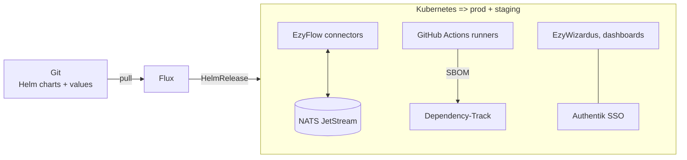
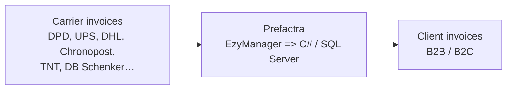
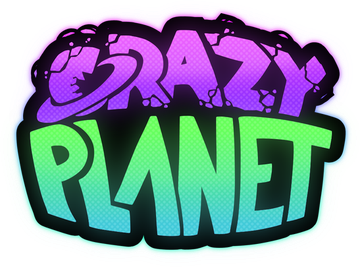
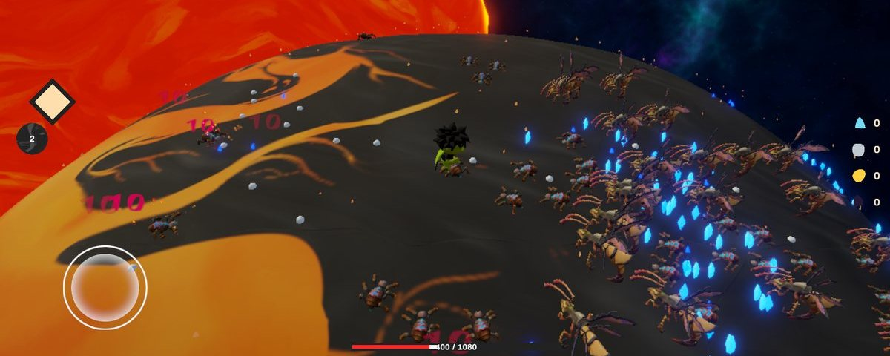
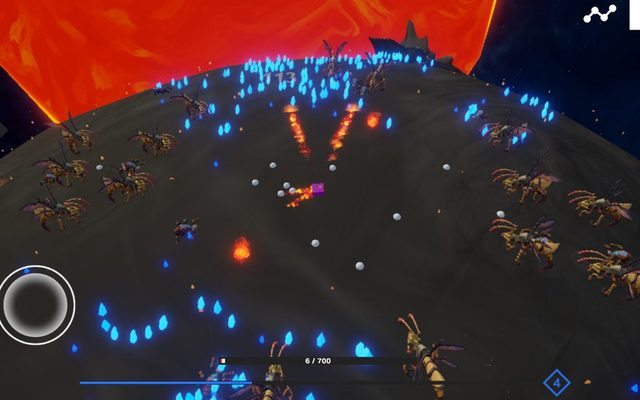
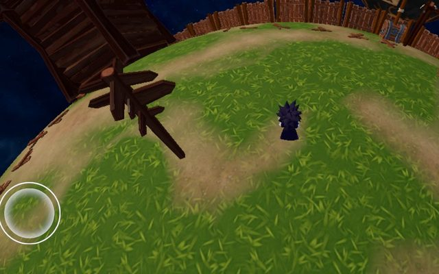
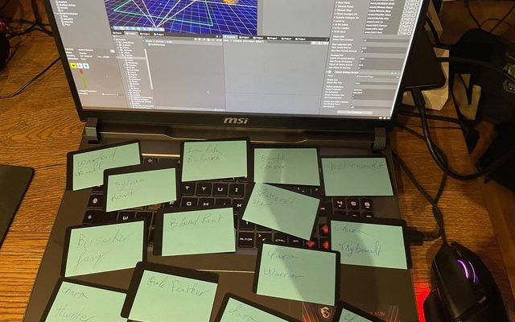

<p align="center">
  <a href="https://github.com/DenverCoder1/readme-typing-svg"></a>
</p>

<p align="center">
  <a href="https://www.linkedin.com/in/thybault-jallu-14a069319/"></a>
  <a href="https://troupote.itch.io"></a>
  <a href="https://github.com/ThybaultJallu"></a>
</p>

### Hi, I'm Thybault 👋

I'm a French game programmer who lives where **gameplay code meets sound**. I study computer science at **[Cnam-Enjmin](https://enjmin.cnam.fr/)**, France's national school of video games and interactive media, and I work as a **software developer at [Ezytail](https://www.ezytail.com/)** on a work-study contract.

I was a musician before I was a coder, so I care about how a system *feels* and *sounds*, and I like to measure it too. Latest example: I rewrote enemy avoidance in Crazy Planet Survivor and saved **~7 ms per frame with 5,000 entities** on screen.

The other half of my work is backend and platform. At Ezytail I build on **EzyFlow**, our event-driven integration platform (C#, NATS), and on the **Kubernetes** platform it runs on: **Helm** charts, **GitOps with Flux**, SSO, supply-chain security. After hours I run a **Talos Linux** homelab where I self-host whatever I need.

```csharp
var thybault = new Developer
{
    Role     = "Gameplay & Audio Programmer",
    Stack    = ["C#", "C++", "Unity ECS", "FMOD", ".NET", "SQL Server"],
    Ops      = ["Kubernetes", "Helm", "Flux (GitOps)", "Talos", "NATS", "Docker"],
    Studying = "Bachelor's in Computer Science, Video Games · Cnam-Enjmin (2024 → 2027)",
    Working  = "Software Developer · Ezytail (work-study)",
    Speaks   = ["French (native)", "English (professional)"],
    Based    = "Paris region & Angoulême, France",
    OpenTo   = ["gameplay", "audio", "tools", "backend", "devops"], // France, abroad or remote
};
```

## 💼 Experience

**Software Developer, work-study** · [Ezytail](https://www.ezytail.com/) · Paris region · 2025 → today
<br><sub>Ezytail is a B Corp certified e-commerce logistics and IT company: warehousing, transport and software for online retailers.</sub>

#### Production platform: Kubernetes, Helm, Flux



- **GitOps on two clusters.** Production and staging run on Kubernetes and are driven from Git by Flux. I ship services as HelmReleases and keep them reconciled.
- **Helm charts.** I wrote the charts for EzyWizardus and the internal dependency dashboard, with Authentik SSO and a chart release workflow.
- **Platform services.** I deployed Dependency-Track on its own CloudNativePG PostgreSQL, the Radar Kubernetes UI with scoped RBAC for staff and engineering, and EzyFlow's analytics stream.
- **CI inside the cluster.** I moved GitHub Actions workflows (EzyManager, the EzyFlow framework, the canonical domain) to runners that live in Kubernetes.
- **Supply-chain security.** CycloneDX SBOMs built in CI and published to Dependency-Track, with policies, drift detection against internal libraries and release notifications to consuming repos.

#### EzyFlow: event-driven integration platform

EzyFlow moves Ezytail's orders, products and invoices between online stores, the ERP and logistics systems: C# connectors over **NATS JetStream**, deployed on the Kubernetes platform above.

- **Shopify connector.** Migrated it to the GraphQL Admin API (ShopifySharp), fixed order and product sync (IDs and GIDs, option serialisation) and masked secrets in error messages.
- **Framework releases.** SBOM and Dependency-Track publishing in the release pipeline of the shared EzyFlow packages, on Kubernetes runners.
- **Docs tooling.** An AI-docs CLI and corpus that help find the right connector.

#### Billing automation: Prefactra



- **Prefactra, billing automation (B2B / B2C).** The pre-invoicing side of EzyManager: it turns carrier costs into client invoices, so Ezytail stops acting as a financial buffer between carriers and clients.
- **A dozen carriers.** Invoice readers, models and stagers for DPD, UPS, DHL, Chronopost, TNT, DB Schenker and more, with overcharge calculation and matching to customer accounts and sub-accounts.
- **I own the project, not just the code.** I run its day-to-day and I'm the bridge between the business teams and R&D: gathering needs, reporting progress, shipping features.
- **SQL and architecture.** Optimised SQL Server queries that were too slow, and refactored the code around OOP principles and UML models.
- **Invoice tooling.** Wrote the first invoice generator ([.NET 9, ClosedXML](https://github.com/ThybaultJallu/EzyInvoiceMaker)), which splits the monthly billing ledger into one formatted invoice per client. The EzyManager CLI has since replaced it.

#### EzyWizardus: pricing grid injector

- **Main author** (130+ of its 157 commits) of a **Next.js** app that bulk-imports carriers' transport pricing grids from Excel into the Directus CMDB behind EzyPricing: parsing, company, carrier and contract matching, ISO country checks, live progress.
- Grew from a C# console prototype into a production web app with **Authentik SSO**, shipped on Kubernetes with its own Helm chart.

**61 merged pull requests** since February 2025 and **270+ contributions** over the last 12 months, all in Ezytail's private repositories, on my work account [@ThybaultJallu](https://github.com/ThybaultJallu).

> *"A very committed apprentice who fits easily into ongoing projects. Very organised, and communicates task progress very well."*
> <br>— my tutor at Ezytail (translated from French)

## 🎮 Featured game: Crazy Planet Survivor

<p align="center">
  <a href="https://troupote.itch.io/crazy-planet-survivor"></a>
</p>

<a href="https://troupote.itch.io/crazy-planet-survivor"></a>

A frantic **360° bullet heaven**: you fight hordes across the whole surface of spherical planets, with no screen edge to hide behind. Built on **Unity 6 and ECS** to push thousands of entities on **Windows and Android**. It's our year-long Cnam-Enjmin project, and it's still in development.

<p>
  <a href="https://troupote.itch.io/crazy-planet-survivor"></a>
  <a href="https://github.com/Athyrr/Crazy-Planet-Survivor"></a>
  
  
  
</p>

**Team:** 2 developers and 1 tech artist, with music by Baptiste Blanc. **Me:** 200+ commits across performance, gameplay, audio, mobile and tools.

| Area | What I built |
|---|---|
| **Performance** | Rewrote enemy avoidance for a native 3D map: **−7 ms per frame at 5,000 entities**, now **under 1 ms**. Spawner **~5 ms**, adaptive performance **~10 ms per frame**, faster targeting. |
| **Gameplay** | Movement, XP orbs, critical hits (with their shader), resistances, a global stat database with upgrades, wave loop and presets, difficulty scaling, the first boss. |
| **Audio** | FMOD from setup to ship: audio manager, SFX integration with buffering, mixer and volume settings. |
| **Mobile** | Android builds and **NFC**: tap a physical card on the phone to pick your character or amulet. |
| **Tools** | In-editor stats tool, camera preset editor, spawner inspector. |
| **UI** | HUD, lobby, pause and settings menus, shop animations. |

<p align="center">
  
  
  
</p>

## 🕹️ More games

<p align="center">
  <a href="https://github.com/Troupote/BlackHoleRun"></a>
  <a href="https://github.com/Troupote/LaToutePetiteMiniville"></a>
</p>

| Game | What it is | My part |
|---|---|---|
| [**BlackHoleRun**](https://github.com/Troupote/BlackHoleRun) | Unity space game, team of 5 (2025) | **Audio programmer.** Rebuilt the FMOD audio system on world positions, 5.1 surround with hardware detection, spatializer, EQ, panner and filter automation, music tempo driven by gameplay. |
| [**La Toute Petite Miniville**](https://github.com/Troupote/LaToutePetiteMiniville) | Two-player dice and city-building card game in Unity, team of 5 | Menus and UI, music and sound effects, UML design. |
| [**Fighting game**](https://github.com/Troupote/Jeu-de-combat) | Turn-based duel against an AI, 4 classes with special abilities | Duo project in C#, WPF and XAML. |
| **Game of Life** | Conway's cellular automaton in three flavours: [console](https://github.com/Troupote/JeuDeLaVieConsole), [graphical](https://github.com/Troupote/JeuDeLaVieGraphique) and [mutant cells](https://github.com/Troupote/CelluleMutante) | Solo, C#. |

Outside games, I also built [**ZendeskToSqlDatabase**](https://github.com/Troupote/ZendeskToSqlDatabase), a .NET console app that exports every Zendesk ticket and user into SQL Server so support data can be queried in SQL.

## 🧰 Toolbox

<p align="center">
  
</p>

| Area | Tools |
|---|---|
| **Games** | Unity 6 (ECS), C#, C++ (RAII, move semantics), FMOD Studio, Blender, rigging and skinning, game and level design, Android and NFC |
| **Software** | C# / .NET, SQL Server, NATS JetStream, TypeScript, Next.js / React, Directus, WPF / XAML, OOP and UML, Python, Turso |
| **Audio & video** | Music production, sound design, adaptive music, 5.1 mixing, Reaper, Premiere Pro, DaVinci Resolve |
| **DevOps & platform** | **Kubernetes** (in production at Ezytail, and on my Talos Linux homelab), **Helm** charts, **Flux** (GitOps), CloudNativePG, Authentik SSO, Dependency-Track and CycloneDX SBOMs, GitHub Actions on Kubernetes runners, Docker, Git, Linux (daily Arch user) |

## 📈 Activity

<p align="center">
  <a href="https://github.com/ThybaultJallu"></a>
  <a href="https://github.com/Troupote"></a>
  <br><sub>Left: work account, mostly private Ezytail repos. Right: this account, games and personal projects.</sub>
</p>

<picture>
  <source media="(prefers-color-scheme: dark)" srcset="https://raw.githubusercontent.com/Troupote/Troupote/output/github-snake-dark.svg">
  <source media="(prefers-color-scheme: light)" srcset="https://raw.githubusercontent.com/Troupote/Troupote/output/github-snake.svg">
  
</picture>

## 🌍 Let's work together

I'm looking for **game programming** roles (gameplay, audio, tools, engine), **DevOps / platform** roles (Kubernetes, GitOps) and **software engineering** roles, in France, abroad or remote. The quickest way to reach me is [LinkedIn](https://www.linkedin.com/in/thybault-jallu-14a069319/).

<details>
<summary>🇫🇷 <b>En français</b></summary>
<br>

Développeur jeu vidéo, en licence informatique parcours Jeu Vidéo au **Cnam-Enjmin** (2024 → 2027) et **développeur en alternance chez Ezytail**. J'y développe **Prefactra**, l'application C# / SQL Server qui automatise la facturation entre transporteurs et clients (B2B / B2C), et je fais le lien entre les équipes métier et la R&D. Je travaille aussi sur **EzyFlow**, la plateforme d'intégration événementielle d'Ezytail (C#, NATS), et sur la plateforme **Kubernetes** qui la fait tourner : charts **Helm**, GitOps avec **Flux**, SSO Authentik, Dependency-Track. Chez moi, je fais tourner un homelab sous **Talos Linux**.

Côté jeu : gameplay, performance (Unity ECS) et intégration audio (FMOD) sur **Crazy Planet Survivor** et **BlackHoleRun**. Musicien avant d'être développeur.

Ouvert aux opportunités en France, à l'étranger ou en remote : écrivez-moi sur [LinkedIn](https://www.linkedin.com/in/thybault-jallu-14a069319/).

</details>


